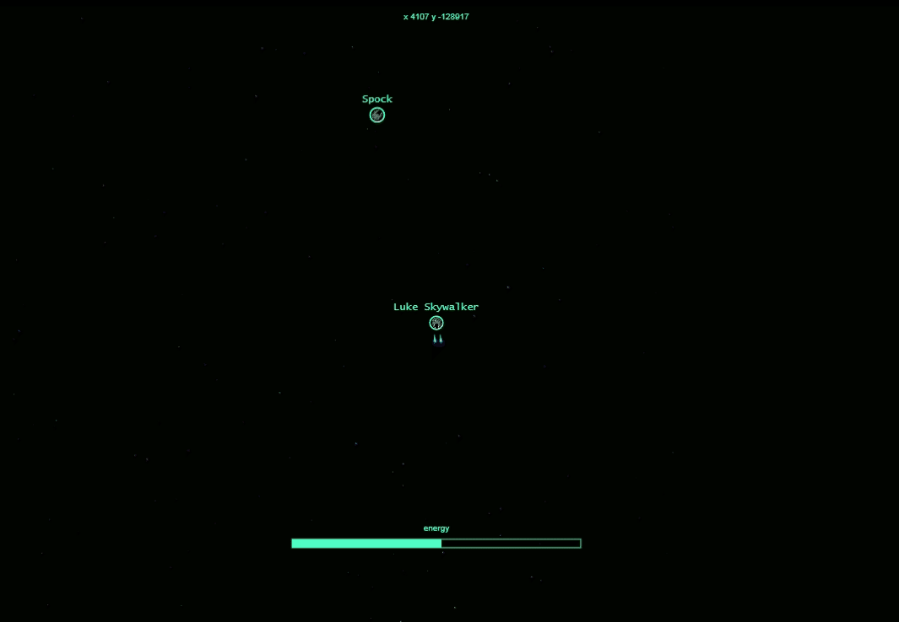

# Progspace

Progspace is a multiplayer game project that i m developing for myself trainning with Javascript/Node.js and Sockets.io.

Current game state:

* [x] Almost Infinite world (it keeps continue until integer limit broke - not tested)
* [x] Player can join game with username/password(no registration needed)
* [x] Player can move ASDW
* [x] Player can attack with basic projetils (mouse hold)
* [x] Player loses energy shield when attacked
* [x] Player dies if energy shield is destroyed
* [x] Player ship turns angle to mouse position when attacking
* [x] Player turn off propulsor when attacking
* [x] Stars are generated by server and saved in memory.
* [x] Stars parallax ()
* [x] Player can ZOOM in and out with mouse scroll

TODO:

* [ ] Players respawn
* [ ] Kills ranking
* [ ] Enemies bots
* [ ] Players can find/collect weapons in space
* [ ] Collected weapons have limited uses(stackable) ?
* [ ] World map or radar
* [ ] Players can select ship model
* [ ] Players can upload new ship model

RUN PROJECT:

Requirements:
* NodeJS/NPM

On project root:
* npm install
* npm start
